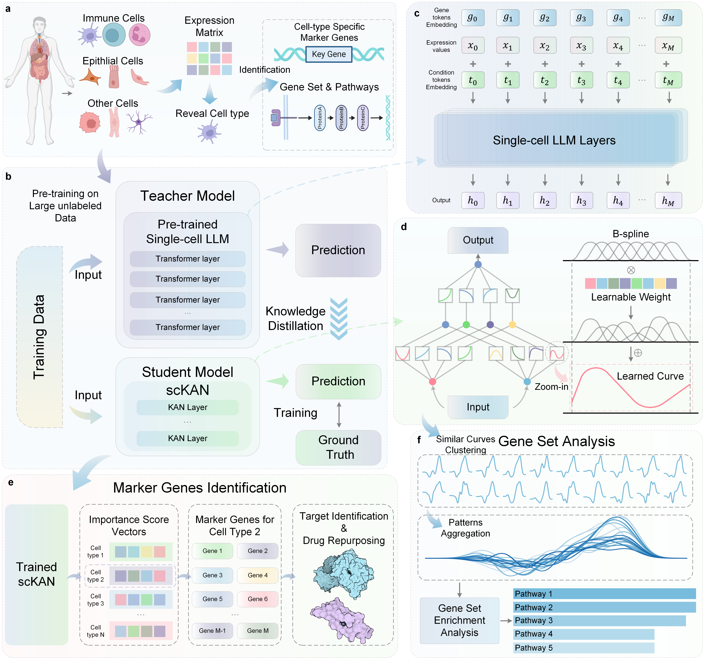

#  scKAN

## Interpretable Single-cell Analysis for Cell-type-specific Gene Discovery and Drug Repurposing via Kolmogorov-Arnold Networks 



## Hardware requirements
`scKAN` package requires only a standard computer with enough RAM and a NVIDIA GPU to support operations.
We ran the demo using the following specs:

+ CPU: 32 cores, 2.60 GHz/core
+ RAM: 64 GB
+ GPU: NVIDIA GeForce RTX 3090

## System requirements
This tool is supported for Linux. The tool has been tested on the following system:

+ Debian Linux 6.1.94-1 (kernel version 6.1.0-22) with x86_64 architecture

## Installation
To install the required packages for running scKAN, please use the following command:
```bash
conda create -n <env_name> python==3.9
conda activate <env_name>
pip install -r requirements.txt
```

### Time cost
Typical install time on a "normal" desktop computer is about 30 minutes.


## Usage
The training of scKAN consists of two steps: finetuning the single-cell Large Language Model and distillated the scKAN. Note that all the commands are run in the `code` folder.

```bash
cd ./code
```


## Dataset Pre-processing

1. Download the Muto-2021 dataset from [scGLUE documentation](https://scglue.readthedocs.io/zh-cn/latest/data.html)
2. Place the downloaded files in the `./data/muto2021` directory
3. Run the dataset splitting script:

```bash
python dataset_processing.py
```

### Expected Output
The script will generate `train_data` and `test_data` directories in the current folder.

## 1. Finetuning the Single-cell Large Language Model

### Prerequisites
1. Download the whole-human model checkpoint following the instructions from [scGPT repository](https://github.com/bowang-lab/scGPT)
2. Place the checkpoint files in the `save` directory

### Running Finetuning
Execute the following command:
```bash
python stage1.py
```

### Time cost
Expected run time for demo on a "normal" desktop computer is about 300 minutes.

### Expected Output
The script will create a directory named `muto_llm_finetuning_muto2021-{timestamp}` under `code/save/`, containing:
- `run.log`: Training progress and metrics
- `result.pkl`: Performance evaluation outputs
- `model.pt`: The finetuned model weights

## 2. Distillation for scKAN

### Setup
Before running the distillation, update the finetuned LLM path in `stage2.py`:
```python
path = "./save/muto_llm_finetuning_muto2021-{timestamp}"
```
Replace `{timestamp}` with your actual finetuned model directory timestamp.

### Running Distillation
Execute the following command:
```bash
python stage2.py
```

### Time cost
Expected run time for demo on a "normal" desktop computer is about 60 minutes.

### Expected Output
The script will create a directory named `distillation_student_model_muto2021-{timestamp}` under `code/save/`, containing:
- `run.log`: Training progress and metrics
- `result.pkl`: Distillation results and evaluations
- `best_model.pth`: The optimized student model weights

